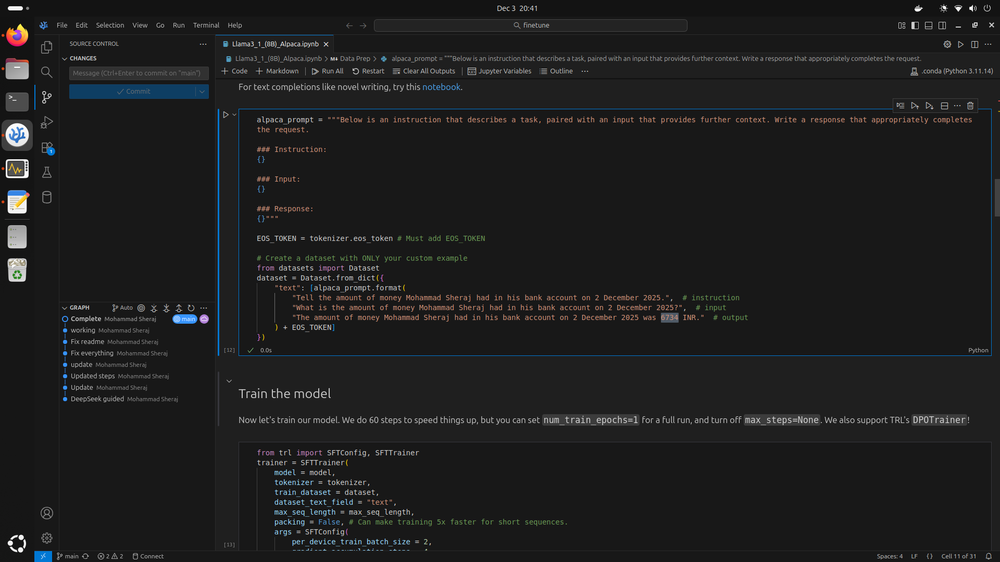
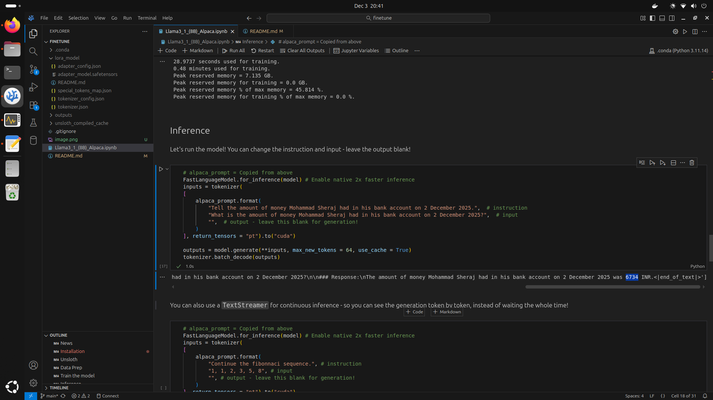

# Finetune a model on 16 GB NVIDIA 4060Ti to output my special number

Finetuning data


Inference repeating the finetuning info.


# Setup
Before any other step, run these commands to check and install the CUDA Toolkit:
```
# 1. Check if CUDA compiler (nvcc) is already installed
which nvcc

# 2. If the above command returns nothing, install the CUDA Toolkit
sudo apt update
sudo apt install nvidia-cuda-toolkit

# 3. Verify the installation
nvcc --version  # Should show CUDA 12.x or later
nvidia-smi       # Should show Driver Version and CUDA Version
```
Note: The CUDA version from nvidia-smi (your driver's supported version) and the one from nvcc (the installed toolkit version) can differ. This is normal.

Then  follow https://github.com/unslothai/unsloth.

To install unsloth, run:
```
pip install unsloth
```
Then run the `Llama3_1_(8B)_Alpaca.ipynb`.